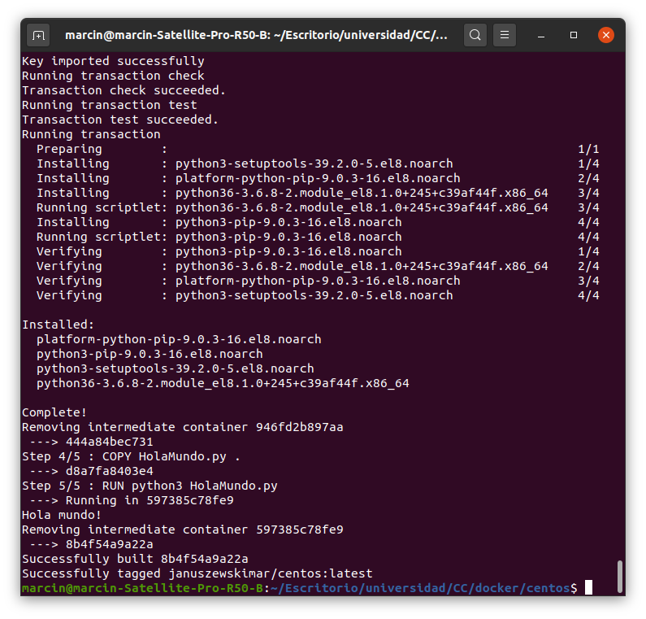

# Tema 3 - Contenedores y cómo usarlos

## Ejercicio 1
### Buscar alguna demo interesante de Docker y ejecutarla localmente, o en su defecto, ejecutar la imagen anterior y ver cómo funciona y los procesos que se llevan a cabo la primera vez que se ejecuta y las siguientes ocasiones.

Para instalar docker he utilizado [este tutorial](https://docs.docker.com/engine/install/ubuntu/). Primero añado la clave de GPG del repositorio de Docker mediante el siguiente comando:

```
curl -fsSL https://download.docker.com/linux/ubuntu/gpg | sudo apt-key add -
```

Configuro el repositorio correspondiente para usar versiones estables:

```
sudo add-apt-repository \
   "deb [arch=amd64] https://download.docker.com/linux/ubuntu \
   $(lsb_release -cs) \
   stable"
```

Actualizo el índice de paquetes de apt.

```
sudo apt-get update
```

E instalo Docker Engine y containerd.

```
sudo apt-get install docker-ce docker-ce-cli containerd.io
```

Se puede verificar si se ha instalado correctamente mediante este comando:

```
sudo docker run hello-world
```


Para poder ejecutar docker sin sudo hay que añadir el usuario al grupo docker.

```
sudo usermod -aG docker ${USER}
```

En [este tutorial](https://www.digitalocean.com/community/tutorials/how-to-install-and-use-docker-on-ubuntu-20-04-es) encontré una solución para no tener que cerrar e iniciar sesión para que se aplique el cambio.

```
su - ${USER}
```

Mediante el siguiente comando se puede comprobar si se está en el grupo docker:

```
id -nG
```


Ahora se puede ejecutar el comando sin sudo:

```
docker run hello-world
```


Para realizar otra prueba voy a ejecutar el comando:

```
docker run --rm jjmerelo/docker-daleksay -f smiling-octopus Uso argumentos, ea

```

En la primera ejecución se descargan los paquetes necesarios:


En las siguientes ejecución los paquetes están descargados ya y no se vuelven a descargar.


## Ejercicio 2
### Tomar algún programa simple, “Hola mundo” impreso desde el intérprete de línea de órdenes, y comparar el tamaño de las imágenes de diferentes sistemas operativos base, Fedora, CentOS y Alpine, por ejemplo.

Creé un archivo en Python con una sola línea:

```
print("Hola mundo!")
```

Más tarde creé un Dockerfile para Fedora:

```
FROM fedora:latest
WORKDIR /home/marcin/Escritorio/universidad/CC/docker/fedora
RUN yum install python3
COPY HolaMundo.py .
RUN python3 HolaMundo.py
```

Y lo ejecuté:


Después creé un Dockerfile para CentOS:

```
FROM centos:latest
WORKDIR /home/marcin/Escritorio/universidad/CC/docker/centos
RUN yum install -y python3
COPY HolaMundo.py .
RUN python3 HolaMundo.py
```

Y lo ejecuté:



El último Dockerfile lo creé para CentOS:

```
FROM alpine:latest
WORKDIR /home/marcin/Escritorio/universidad/CC/docker/alpine
RUN apk update
RUN apk upgrade
RUN apk add python3
COPY HolaMundo.py .
RUN python3 HolaMundo.py
```

Y lo ejecuté:


El tamaño de cada contenedor se puede ver aquí:


Como se ve en la imagen, el contenedor que menos pesa es el de Alpine. El de CentOS pesa más y el que más pesa es el de Fedora.

## Ejercicio 3
### Crear a partir del contenedor anterior una imagen persistente con commit.

He usado el contenedor de Alpine. Primero miré el identificador del contenedor para después usarlo en el comando commit.


## Ejercicio 4
### Examinar la estructura de capas que se forma al crear imágenes nuevas a partir de contenedores que se hayan estado ejecutando.

He usado el contenedor de Alpine. Primero instalé jq y posteriormente ejecuté el siguiente comando:

```
sudo jq '.' /var/lib/docker/image/overlay2/imagedb/content/sha256/ddd9e0c2a1d4d9176d1908e80b89e4c05e4f0c62511efce91ef593c651078073
```


## Ejercicio 5
### Crear un volumen y usarlo, por ejemplo, para escribir la salida de un programa determinado.

He creado un volumen y lo he usado en un contenedor.


Después he mirado los detalles del volumen para ver cómo se podía acceder a los datos y visualicé el fichero correspondiente.


## Ejercicio 6
### Reproducir los contenedores creados anteriormente usando un Dockerfile.

Los contenedores del ejercicio 2 se han creado con un Dockerfile.

## Ejercicio 7
### Usar un miniframework REST para crear un servicio web y introducirlo en un contenedor, y componerlo con un cliente REST que sea el que finalmente se ejecuta y sirve como “frontend”.

Creé un contenedor para el back end usando Python y flask-restful. En el código fuente tuve que importar también flask_cors, un módulo que añade a las cabeceras de las respuestas una entrada que permite en el navegador el intercambio de recursos de origen cruzado. El código es el siguiente:

```
from flask import Flask
from flask_restful import Resource, Api
from flask_cors import CORS
from datetime import datetime

app = Flask(__name__)
CORS(app)
api = Api(app)


class Welcome(Resource):
    def get(self):
      return {'message': 'Welcome message from back end'}

class User(Resource):
    def get(self, name):
        return {'name': name, 'time': datetime.now().strftime("%m/%d/%Y, %H:%M:%S"), 'details': 'Not authorized'}

api.add_resource(Welcome, '/')
api.add_resource(User, '/user/<string:name>')

if __name__ == '__main__':
    app.run(host='0.0.0.0')
```

El front end lo realicé en JavaScript y React con ayuda de [este tutorial](https://mherman.org/blog/dockerizing-a-react-app/).

```
import './App.css';
import React from 'react';

class App extends React.Component{
  constructor(props){
  	super(props);
  	this.state = {name: "", time: "", details: ""};
  	this.send = this.send.bind(this);
  }
  
  send (event){
    event.preventDefault();
    var xmlhttp = new XMLHttpRequest();
    var url = "http://localhost:5000/user/" + document.getElementById('user').value;
    var that = this;
    xmlhttp.onreadystatechange = function() {
    if (this.readyState === 4 && this.status === 200) {
        console.log(this.responseText);
        var data = JSON.parse(this.responseText);
	    that.setState(state => ({
	    	name: data['name'], time: data['time'], details: data['details']
	    }));
    }
    else{
	    that.setState(state => ({
	    	name: "Error", time: "Error", details: "Error"
	    }));
    }
    }
    xmlhttp.open("GET", url, true);
    xmlhttp.send();
  }
  
  render (){ 
    return(
      <div className="App">
          <h2>Welcome</h2>
          <form onSubmit={this.send}>
            <label>
              User you want to check: 
              <input type="text" id="user" />
            </label>
            <input type="submit" value="Submit" />
          </form>
          <div id="result">
            <p>Name: {this.state.name}</p>
            <p>Time: {this.state.time}</p>
            <p>Details: {this.state.details}</p>
          </div>
      </div>
    )
  }
}

export default App;
```

Para el fichero de configuración de docker-compose en el caso del front end me basé también en [el tutorial mencionado anteriormente](https://mherman.org/blog/dockerizing-a-react-app/):

```
version: '3.7'
services:
  backend:
    container_name: backend
    build:
      context: ./backend
      dockerfile: Dockerfile
    ports:
      - "5000:5000"
    expose:
      - "5000"
    hostname: 'backend'
  frontend:
    container_name: frontend
    build:
      context: ./frontend
      dockerfile: Dockerfile
    volumes:
      - './frontend:/app'
      - '/app/node_modules'
    ports:
      - "3001:3000"
    environment:
      - CHOKIDAR_USEPOLLING=true
    depends_on:
      - backend
```

La salida de `docker-compose up` es la siguiente:


Ejemplos de acceso al back end desde el navegador:


Ejemplos de acceso mediante el front end:


