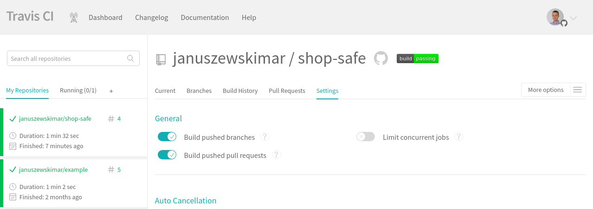
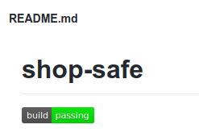

# Tema 4 - Integración continua

## Ejercicio 1
### Ejercicio: Haced los dos primeros pasos antes de pasar al tercero.

El primer paso ya se hizo en uno de los ejercicios anteriores.

## Ejercicio 2
### Configurar integración continua para nuestra aplicación usando Travis o algún otro sitio.

He activado el repositorio en Travis CI y he creado el fichero de configuración que se puede consultar [aquí](https://github.com/januszewskimar/shop-safe/blob/main/.travis.yml). Además, he creado un badge en el README del proyecto:

