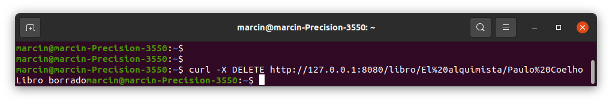
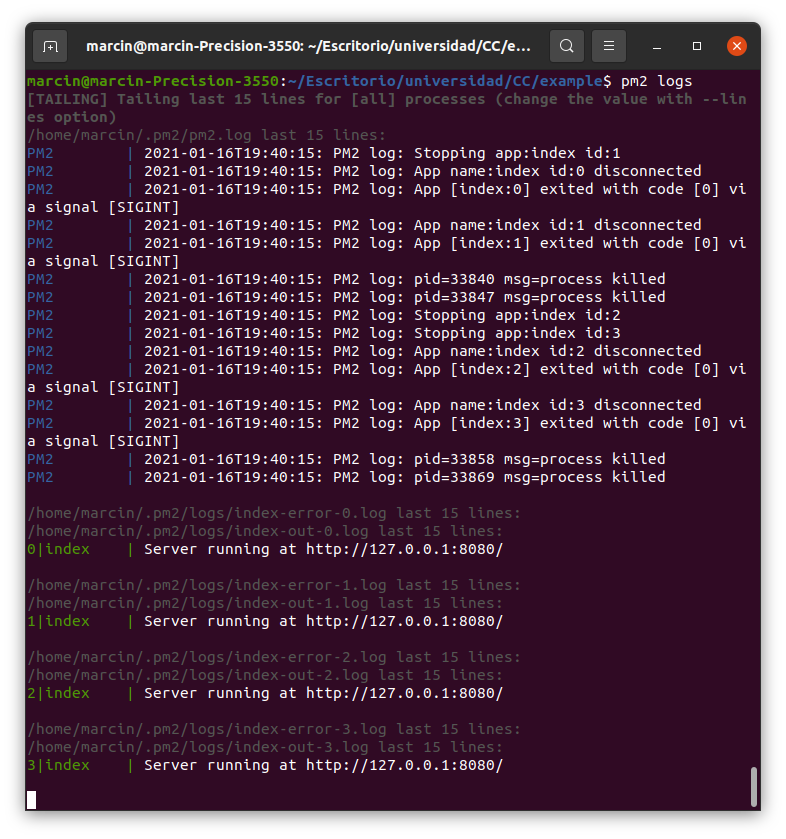
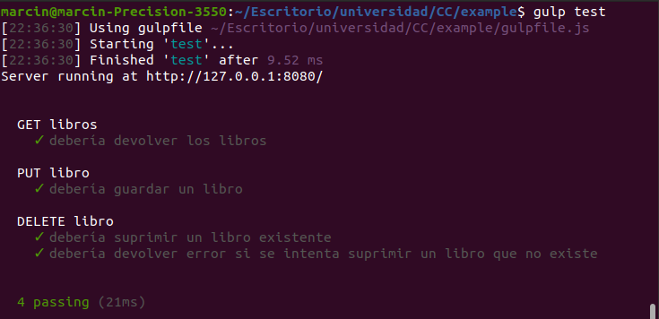

# Tema 6 - Microservicios

## Ejercicio 1
### Instalar etcd3, averiguar qué bibliotecas funcionan bien con el lenguaje que estemos escribiendo el proyecto (u otro lenguaje), y hacer un pequeño ejemplo de almacenamiento y recuperación de una clave; hacer el almacenamiento desde la línea de órdenes (con etcdctl) y la recuperación desde el mini-programa que hagáis.

Instalo etcd en la línea de órdenes.

```
sudo apt install etcd
```

Elijo [la biblioteca más popular](https://www.npmjs.com/package/etcd3). La instalo mediante la siguiente orden:

```
npm install --save etcd3`
```

Me encuentro con un problema a la hora de exportar la variable en la línea de órdenes: `No help topic for 'put'`. Lo soluciono aplicando un consejo explicado en [esta página](https://github.com/etcd-io/etcd/issues/6897). Es necesario ejecutar antes:

```
export ETCDCTL_API=3
```

Escribo el siguiente código:

```
const { Etcd3 } = require('etcd3');
const client = new Etcd3();

(async() => {
	const clave = await client.get('clave').string();
	console.log('clave:', clave);
})();
```

El resultado es el siguiente:


## Ejercicio 2
### Realizar una aplicación básica que use algún microframework para devolver alguna estructura de datos del modelo que se viene usando en el curso u otra que se desee. La intención de este ejercicio es simplemente que se vea el funcionamiento básico de un microframework, especialmente si es alguno que, como express, tiene un generador de código. Se puede usar, por otro lado, el lenguaje y microframework que se desee.

Escribo la aplicación usando Node y Express.

```javascript
#!/usr/bin/env node

class Libro{
	constructor(titulo, autor, anio, opiniones){
		this.titulo = titulo;
		this.autor = autor;
		this.anio = anio;
		this.opiniones = opiniones;
	}
}

var express = require('express');
var app = express();
var port = process.env.PORT || 8080;

var opiniones = [ {"valoracion": 5, "contenido": "interesante", "usuario":"camilo123"}, 
		  {"valoracion": 3, "contenido": "regular", "usuario":"gabi321"}, 
		]
var libro = new Libro("Un título", "Un autor", 2001, opiniones);

app.get('/', function (req, res) {
    res.send( libro );
});

app.listen(port);
console.log('Server running at http://127.0.0.1:'+port+'/');
```

Lanzo la aplicación:


En el navegador veo la respuesta de la función:


## Ejercicio 3
### Programar un microservicio en express (o el lenguaje y marco elegido) que incluya variables como en el caso anterior.

El código incluye variables y peticiones de varios tipos. El código es el siguiente:

```javascript
#!/usr/bin/env node

class Libro{
	constructor(titulo, autor, anio, opiniones){
		this.titulo = titulo;
		this.autor = autor;
		this.anio = anio;
	}
}

var express = require('express');
var app = express();
var port = process.env.PORT || 8080;

var libro1 = new Libro("El alquimista", "Paulo Coelho", 1988);
var libro2 = new Libro("Don Quijote de la Mancha", "Miguel de Cervantes", 1605);

var libros = [libro1, libro2];

app.get('/libros', function (req, res) {
	res.send( libros );
});

app.put('/libro/:titulo/:autor/:anio', function (req, res) {
	var libro = new Libro(req.params.titulo, req.params.autor, req.params.anio);
	if (libros.indexOf(libro) == -1){
		libros.push(libro);
	}
	res.status(200).send(libro);
});

app.delete('/libro/:titulo/:autor', function (req, res) {
	var index = libros.findIndex(element => element.titulo == req.params.titulo && element.autor == req.params.autor);
	if (index == -1){
		res.status(404).send("No existe tal libro");
	}
	else{
		libros.splice(index,1);
		res.status(200).send("Libro borrado");
	}
});

app.listen(port);
console.log('Server running at http://127.0.0.1:'+port+'/');
```

Hago pruebas mediante curl.





## Ejercicio 4
### Crear pruebas para las diferentes rutas de la aplicación.

Uso Supertest.

```javascript
var request = require('supertest'),
app = require('../index.js');

describe( "GET libros", function() {
    it('debería devolver los libros', function (done) {
       request(app)
           .get('/libros')
           .expect('Content-Type', /json/)
           .expect(200,done);
    });
});

describe( "PUT libro", function() {
    it('debería guardar un libro', function (done) {
       request(app)
           .put('/libro/Titulo1/Autor1/2000')
           .expect('Content-Type', /json/)
           .expect(200,done);
    });
});
    
describe( "DELETE libro", function() {
    it('debería suprimir un libro existente', function (done) {
       request(app)
           .delete('/libro/El%20alquimista/Paulo%20Coelho')
           .expect('Content-Type', /text/)
           .expect(200,done);
    });
    
    
    it('debería devolver error si se intenta suprimir un libro que no existe', function (done) {
       request(app)
           .delete('/libro/Libro321321/Autor3213')
           .expect('Content-Type', /text/)
           .expect(404,done);
    });
});
```
El resultado es el siguiente:


## Ejercicio 5
### Experimentar con diferentes gestores de procesos y servidores web front-end para un microservicio que se haya hecho con antelación, por ejemplo en la sección anterior.

El primer gestor de procesos que voy a probar es PM2. Lanzo el servicio con 4 instancias.


Miro si funciona en el navegador.


Apago todas las aplicaciones en PM2.


Miro los logs de PM2.



El segundo gestor que voy a testar se llama Forever. Lanzo la aplicación.


Miro si funciona en el navegador.


Lo apago. Para hacerlo miro las aplicaciones que están encendidas usando el comando `forever list`. Busco el PID correspondiente en la salida apago el programa usando el comando `forever stop PID`. Al final compruebo si se ha cerrado usando el mismo comando que antes (`forever list`). 


## Ejercicio 6
### Usar rake, invoke o la herramienta equivalente en tu lenguaje de programación para programar diferentes tareas que se puedan lanzar fácilmente desde la línea de órdenes un microservicio.

Voy a utilizar Gulp y para ello preparo un Gulpfile basándome en el ejemplo del tema de microservicios de la asignatura.

```javascript
const gulp  = require('gulp');
const mocha = require('gulp-mocha');
const pm2   = require('pm2');
var shell = require('gulp-shell');

gulp.task('test', async () => {
  gulp.src('test/test.js', {read: false})
  .pipe(mocha())
});

gulp.task('start', async () => {
  pm2.connect(true, async () => {
    pm2.start({
      name: 'Libros',
      script: 'index.js',
      exec_mode: 'cluster',
      instances: 4
    }, async () => {
         console.log('Arranca libros');
       });
  });
});

gulp.task('stop', async () => {
  pm2.connect(true, async () => {
    pm2.stop( "Libros", async ( err, proc ) => {
      pm2.disconnect();
      console.log("Parando libros");
    });
  });
});
```

Testeo las tareas. Primero la de testeo:



Después ejecuto la que enciende el servicio.


Miro si funciona en el navegador.


Finalmente apago el servicio.


