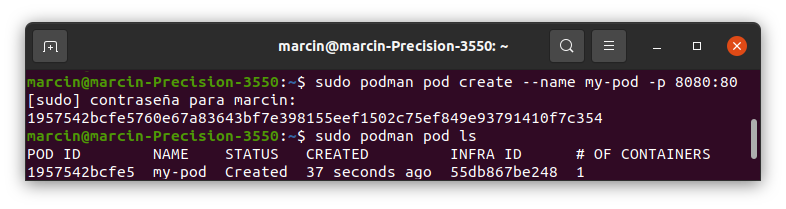
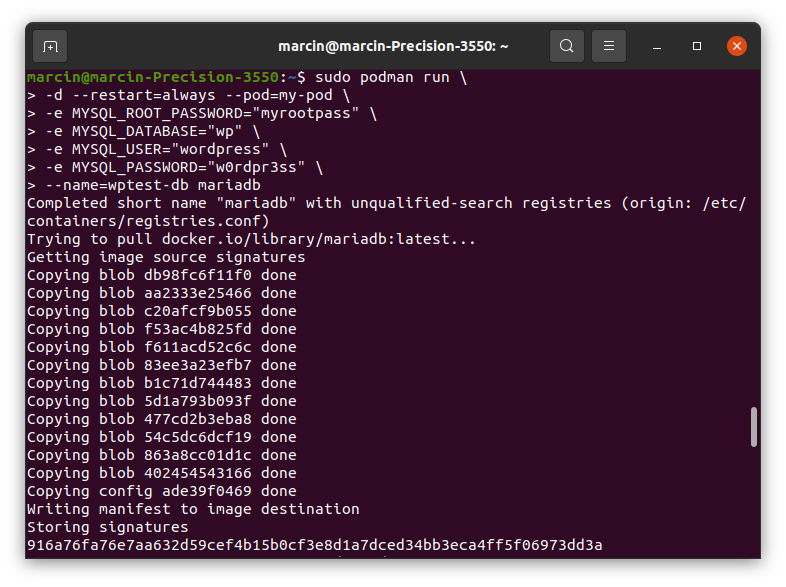
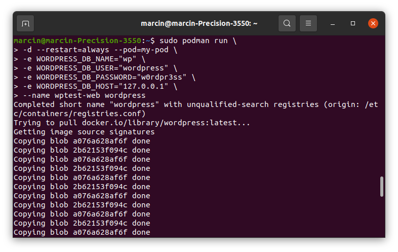
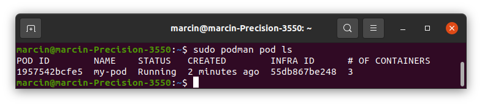
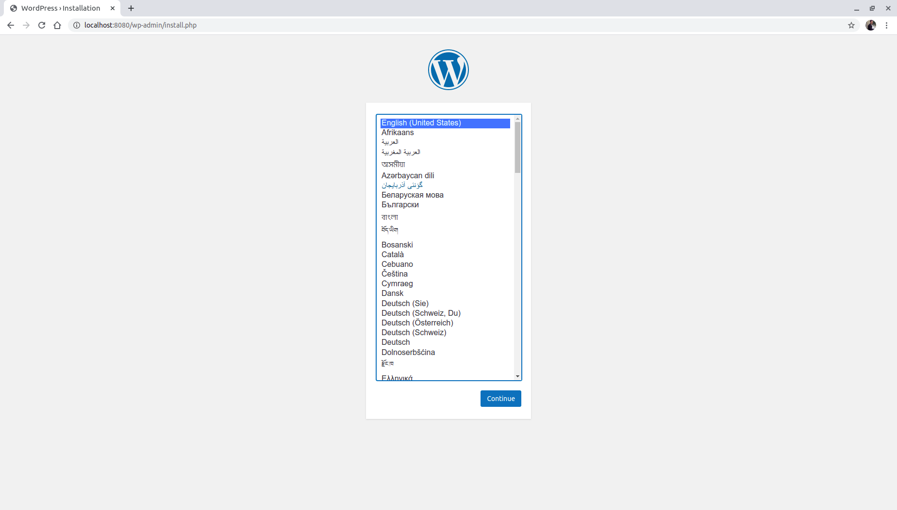

# Tema 7 - Composición de contenedores

## Ejercicio 1
### Crear un pod con dos o más contenedores, de forma que se pueda usar uno desde el otro. Uno de los contenedores contendrá la aplicación que queramos desplegar.

He encontrado [un tutorial](https://www.redhat.com/sysadmin/compose-podman-pods) en la página de RedHat.

Primero creamos un pod con el puerto 8080 mapeado al puerto interno 80. Con el segundo comando listamos los pods.

Ahora vamos a crear un contenedor con la base de datos indicando ajustes de esta usando parámetros en el mismo comando.

El segundo contenedor que vamos a crear contendrá WordPress indicando los parámetros de la base de datos.

Vamos a listar los pods. Se ve que ha cambiado el número de contenedores.

Ahora vamos a abrir en el navegador la página donde se verá la pantalla de configuración del servicio.

## Ejercicio 2
### Usar un miniframework REST para crear un servicio web y introducirlo en un contenedor, y componerlo con un cliente REST que sea el que finalmente se ejecuta y sirve como “frontend”.

Este ejercicio ya se ha realizado en otro tema. Se puede ver [aquí](https://github.com/januszewskimar/CC-ejercicios-autoevaluacion/blob/main/docs/tema-3.md#ejercicio-7).
